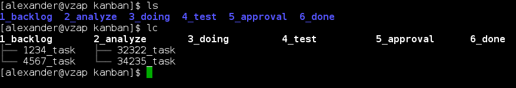
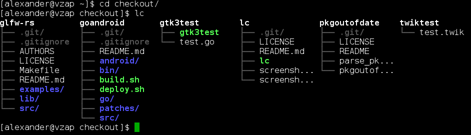

lc
==

List the files in the directories in the current directory, formatted in columns

* Version: 0.1
* License: MIT
* Author: Alexander Rødseth <rodseth@gmail.com>
* Last updated: July 2013

Inspired by [this question](http://unix.stackexchange.com/questions/83072/ls-should-display-contents-of-flat-directory-structure-in-columns).

Tested with Python 2.6.6, 2.7.5 and 3.3.2.

The executable may be installed as /usr/bin/lsc instead of /usr/bin/lc to avoid a naming conflict with the mono package (which provides /usr/bin/lc).

Screenshots
-----------

