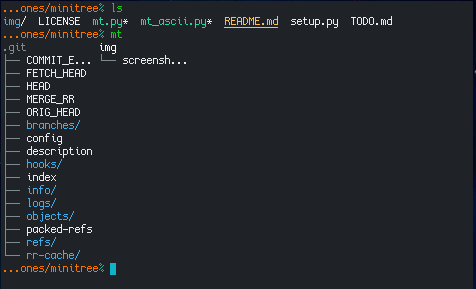

# minitree

List files and directories, one level deep, formatted as columns.

### Screenshot

### Background

* Inspired by [this question](http://unix.stackexchange.com/questions/83072/ls-should-display-contents-of-flat-directory-structure-in-columns).

### Supported Python versions

* Tested with Python 2.6, 2.7, 3.3, 3.5, 3.8 and 3.9. I assume it will work on most versions.

### General info

* Version: 0.4.1
* License: MIT
* Author: Alexander F. Rødseth &lt;xyproto@archlinux.org&gt;
