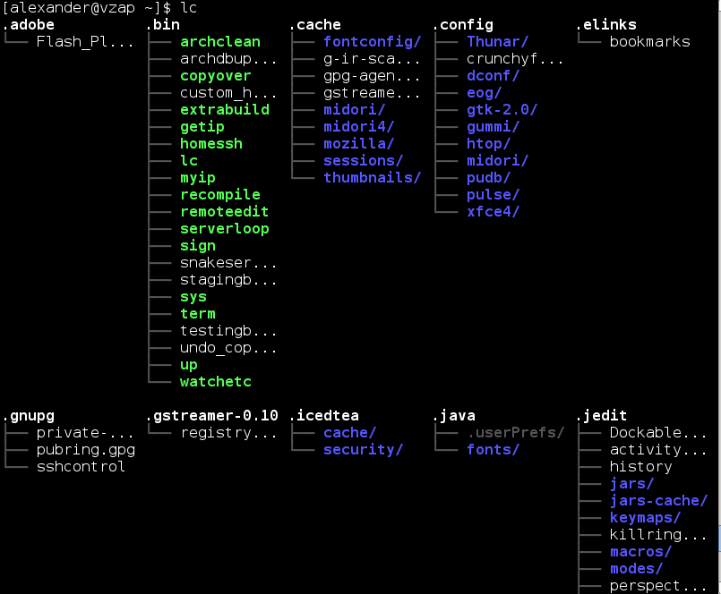

lc
==

"Column-ls"
-----------

List the files in the directories in the current directory, formatted in columns

* Version: 0.1
* License: MIT
* Author: Alexander Rødseth <rodseth@gmail.com>
* Last updated: July 2013

Requires Python 3

Screenshot
----------

