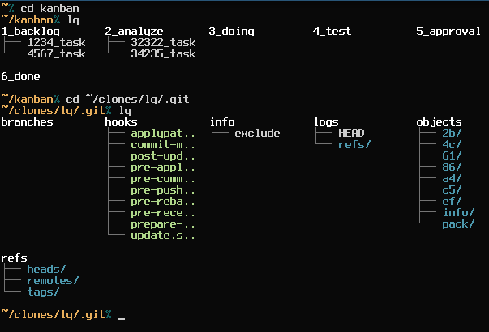

# minitree

List the files in the directories in the current directory, formatted as columns.

Screenshot from an older version:

### Background

Inspired by [this question](http://unix.stackexchange.com/questions/83072/ls-should-display-contents-of-flat-directory-structure-in-columns).

### Supported Python versions

* Tested with Python 2.6, 2.7, 3.3, 3.5 and 3.8. I assume it will work on most versions.

### General info

* Version: 0.4.0
* License: MIT
* Author: Alexander F Rødseth &lt;xyproto@archlinux.org&gt;

